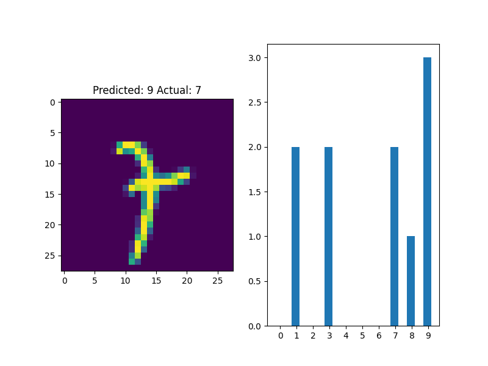
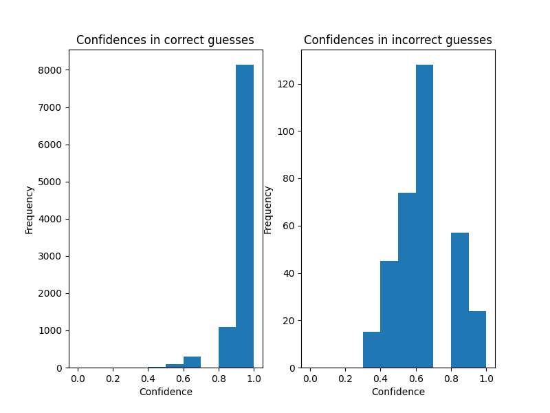

Experiments using bootstrapped randomized prior networks for MNIST classification. Heavily inspired by [this](https://gdmarmerola.github.io/intro-randomized-prior-functions/) blog post. 
This scheme achieves 96.57% accuracy with 10 classifiers trained for 10 epochs. This is extremely suboptimal, both in terms of network
architecture and training time. But it works quite well, which is interesting.

Perhaps more interesting is that the bag of classifiers is capable of a form of confidence scores, as each classifier "votes"
on its prediction. Votes for an incorrect guess can be seen here:



Histograms for confidence scores of correct and incorrect guesses can be seen here:



Configuration for training is at the top. Set LOAD_MODEL to False in order to train your own classifiers. Otherwise, loads the models
from PATH.

Installation:
```
pip3 install -r requirements.txt
```

Run:
```
python3 mnist_randomized_priors.py
```